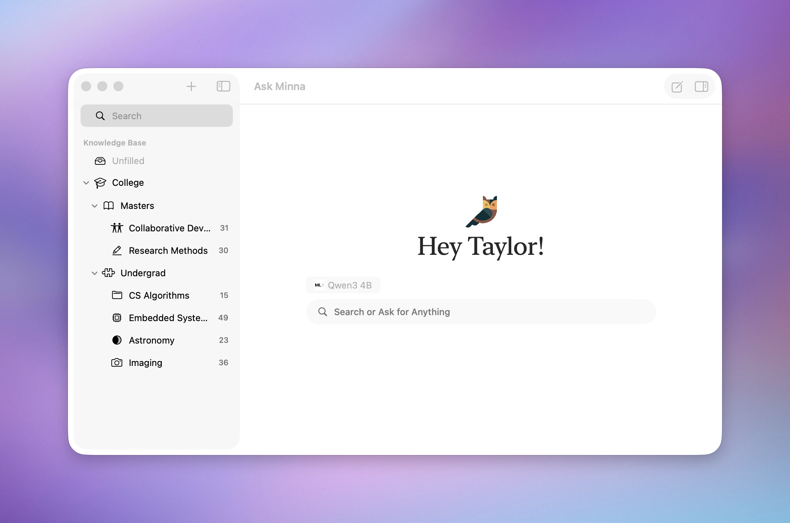

<p align="center">
<picture>
  <source media="(prefers-color-scheme: dark)" srcset="docs/assets/logo_long_dark.png">
  <source media="(prefers-color-scheme: light)" srcset="docs/assets/logo_long_light.png">
  
</picture>
</p>

Minna is a local-first search database and AI assistant for your documents. Files are indexed on **your** Mac, they are never uploaded. All AI content is backed by real sources directly from your database.

> Named after Minerva the Roman goddess of Wisdom.

<p align="center">


</p>

<p align="center">


</p>



# Features
- Search with natural language (vector) & exact match (FTS5) through all files added to Minna. 
	- Search is blazingly fast ~12 ms for 250 long documents (30,000 total document pieces).
	- Add PDF, Markdown, TXT, HTML, XML, and OPML to the search database.
	- The search index is one portable `.irisdb` file you can move between machines.
- Ask Minna about anything in any document.
	- Every generated statement is backed by a direct quote in your database.
	- Citations are presented in a sidebar during genreation.
- Multiple LLM providers:
	- Support for MLX on-device models, the standard is *[Qwen3 4b Instruct](https://huggingface.co/mlx-community/Qwen3-4B-Instruct-2507-4bit)*.
	- Support for on-device and off-device Ollama.
	- Support for Apple Intelligence, when enabled on the system.
	- Support for Claude through an Anthropic Key.
	- Support for OpenAI through an OpenAI Key.
	- Support for Gemini through a Gemini Key.
- Document Preview:
	- Preview files in-place without leaving Minna.
	- Ask Minna about the previewing document.
		- Same feature set as Ask Minna across all documents, except it is constrained to just one file.
- Organize added files into folders & subfolders.
- File Actions:
	- Change file Title or Description manually.
	- Use Apple Intelligence to generate file descriptions.
	- Assign file colors.
- Sort folders by name & creation date.

# Privacy
Minna takes privacy **very** seriously. We believe that your files are your own, and shouldn't be seen by anyone else. Any conversations with an AI go directly to the provide *you* chose, with *your* key.  On-device models (MLX & Apple Foundation Models) make no network calls at all. All LLM provider configurations are encrpyted in the macOS keychain. For more information see [SECURITY.md](SECURITY.md).

## A note on Telemetry
Minna uses [PostHog](https://posthog.com/) for app telemetry. The goal of this telemetry is to get a *broad* understanding of Minna's userbase, and is never used for tracking. Personally Identifiable Information is stripped before being sent to PostHog, and the remote configurations are set to drop IP addresses. We do not want your data, so we do not store it.

# Installation

You can install Minna for macOS 26.0+ by downloading the latest [minna.dmg](https://github.com/impel-intelligence/Minna/releases/latest/download/minna.dmg) from the [releases page](https://github.com/impel-intelligence/Minna/releases/latest).

## Sample Data
Minna works best when you provide it with data. To make finding data easier, a sample of Open Course Work can be [downloaded here](https://github.com/impel-intelligence/Minna/releases/download/0.6.1/Open.Course.Materials.zip).

# Build from Source
Building Minna from source requires macOS 26+, Xcode 26+, and Git LFS. No configuration is needed to build the project. `Config.xcconfig` ships blank, which turns telemtry off, and sets signing ot local. For more details see [CONTRIBUTING.md](CONTRIBUTING.md).

```shell
git clone --recursive https://github.com/impel-intelligence/Minna.git
cd Minna
open Minna.xcodeproj
```

## Testing
Tests for Minna can be run from within Xcode. Tests for submodule projects [IrisSearch](https://github.com/impel-intelligence/IrisSearch) & [LookAtMe](https://github.com/impel-intelligence/LookAtMe) must be run from their respective Swift Packages.

# Architecture
Minna is a fairly standard macOS app. It uses a default Xcode project, with Swift Packages for code isolation. For more information see [ARCHITECTURE.md](docs/ARCHITECTURE.md).

These subpackages are:
- [IrisSearch](https://github.com/impel-intelligence/IrisSearch) (Submodule)
- [LookAtMe](https://github.com/impel-intelligence/LookAtMe) (Submodule)
- MinnaChat
- DatabaseSchema


# Contributing
Contributions to Minna are greatly appreciated! All contributions should include a [Developer Certificate of Origin](https://developercertificate.org), in git this is equivalent to adding `Signed-off-by` at the end of your commits. 


Before you submit anything, make sure to read [CONTRIBUTING.md](CONTRIBUTING.md), [CODE_OF_CONDUCT.md](CODE_OF_CONDUCT.md), and [SECURITY.md](SECURITY.md). All contributions to MINNA

## AI Contributions
AI Contributions are fine, we have and will continue to use AI to write Minna. However, we request that you properly disclose the usage of AI in any code you submit. This helps the maintainers allocate the proper amount of time for code review. All commits that include work from an AI should include a `Co-Authored-By` trailer on commits.

Please do not remove the AI attributions that are added in code. We believe it is important to track the usage of AI, and it significantly helps maintainers during the review process.

## Contact
Minna's development team can be contacted directly at [support@tryminna.com](mailto:support@tryminna.com). If you have any security concerns, for the safety of our users, please contact us directly instead of posting publicly.

## License
Minna is licensed under [Apache-2.0](LICENSE). The code license does not cover the Minna name or marks, see [TRADEMARK.md](TRADEMARK.md) for more information.
